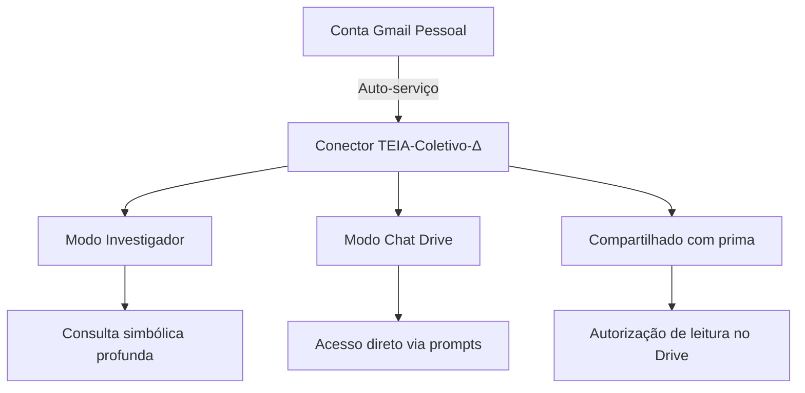

# 2095 - Conectores e orquestração TEIA

### USUÁRIO

{'content_type': 'image_asset_pointer', 'asset_pointer': 'file-service://file-BS5xRfEgZQyDuwAdyTqdGY', 'size_bytes': 235971, 'width': 1920, 'height': 1080, 'fovea': None, 'metadata': {'dalle': None, 'gizmo': None, 'generation': None, 'container_pixel_height': None, 'container_pixel_width': None, 'emu_omit_glimpse_image': None, 'emu_patches_override': None, 'lpe_keep_patch_ijhw': None, 'sanitized': True, 'asset_pointer_link': None, 'watermarked_asset_pointer': None, 'is_no_auth_placeholder': None}}

---

### ASSISTENTE

Perfeito — essas capturas mostram a **interface Admin > Conectores** do ChatGPT (Google Drive + criação de conectores customizados). Vou transformar isso num plano prático e seguro para você integrar conectores ao **fluxo de orquestração cognitiva TEIA**: o que ativar, quando usar *modo agente*, como criar conectores privados com OAuth/ser­vice-account, e controles de governança mínimos. Vou ser conciso e acionável.

# Resumo rápido (decisão)
- **Se for uso organizacional / múltiplos membros:** prefira **Configuração gerida pelo administrador** (conta de serviço + pasta/Shared Drive dedicada). Centraliza credenciais, facilita auditoria e evita que cada membro exponha sua conta pessoal.
- **Se for uso pessoal/prova de conceito:** use **Auto-serviço** (cada membro autentica a própria conta). Mais simples, menos risco central, porém menos controlado.
- **Modo “Investigação a fundo / agente”** dá mais poderes (leitura profunda, ações automatizadas). Só habilite se os arquivos ficarem em **uma pasta dedicada e controlada** e confiar no conector (idealmente hospedado pela sua infra).

# Checklist mínimo antes de ligar um conector (segurança & TEIA)
1. Criar um espaço dedicado (ex.: Shared Drive -> `TEIA_Orquestração`) ou pasta com ACLs controladas.  
2. Escolher **service account** (recomendado) e delegar acesso somente à pasta/Shared Drive.  
3. Determinar o **escopo mínimo** (ex.: `drive.readonly` / acesso limitado a pasta).  
4. Nomear o conector com padrão legível: `TEIA-Drive (service)`; descrição: `Acesso somente leitura a /Shared Drives/TEIA_Orquestração`.  
5. Habilitar logs/auditoria no Admin Console (com registro de quem usou o conector e quando).  
6. Documentar owner + rota de rotação de credenciais (chave/secret a cada X meses).  
7. Testar em ambiente controlado antes de liberar “modo agente”.

# Passo-a-passo — Google Drive (recomendado: admin-managed / service account)
1. No Google Cloud Console:
   - Criar **project** dedicado `teia-orquestracao`.
   - Criar **Service Account** `teia-orchestrator@...`.
   - Gerar key JSON (guarde seguro).
   - Conceder **acesso apenas** ao Shared Drive / pasta (`Content Manager` ou acesso mais restrito).
2. No Admin do ChatGPT (Conectores → Google Drive):
   - Escolher **Configuração gerida pelo administrador**.
   - Informar domínio/workspace e seguir fluxo.
   - Ao solicitar credenciais, carregue/registre a **service account** (ou siga o passo de integração indicado pelo Admin).
   - Nomeie: `TEIA - Drive (service)`. Descrição curta.
   - Escolha **modo de utilização**: inicialmente `Chat` (pesquisa) para validar; depois, se seguro, `Investigação a fundo / modo agente`.
3. Testes:
   - Faça uma busca por um ficheiro conhecido do Shared Drive via ChatGPT e valide resultados.  
   - Revise logs e confirme que só a pasta destinada foi indexada.

# Passo-a-passo — Criar conector personalizado (MCP / OAuth)
Na tela que capturou (Novo conector):
- Campos obrigatórios: **Nome**, **URL do servidor MCP (ex: https://mcp.teia.local/sse)**, **Auth** (OAuth normalmente).
- Requisitos técnicos:
  - **HTTPS válido** (certificado público) para o MCP.
  - Redirect URIs configuradas no provedor OAuth (o admin da OpenAI mostrará um redirect — registre-o).
  - Escopos: expose apenas os recursos necessários (ex.: leitura de APIs específicas).
- Segurança:
  - Marque “Confio nesta aplicação” **só** se o conector estiver hospedado na sua infra e você controlar o endpoint.
  - Não submeta conector com credenciais embutidas; use OAuth 2.0 / JWT.
- Fluxo de criação:
  1. Preparar servidor MCP (endpoints SSE / webhook compatíveis).
  2. Registrar app OAuth no IdP (Google, Azure AD ou outro) e anotar client_id/secret e redirect URI.
  3. Preencher a UI do ChatGPT com URL MCP e selecionar OAuth.
  4. Durante teste, autenticar e validar tokens/escopos.
  5. Documentar proprietário + data de validade do client_secret.

# Boas práticas TEIA (orquestração cognitiva)
- **Pasta/drive como “seed” controlada**: centralize manifests/artefatos TEIA em `TEIA_Orquestracao`. O conector deve ter acesso apenas a ela.
- **Conector com nome fixo e versão** (p.ex. `TEIA-Drive-v1`) para que agentes e playbooks refiram deterministicamente o recurso.
- **Metadados**: ao salvar manifests, inclua `owner`, `sha256`, `created_by`, `purpose=teia` para rastreabilidade.
- **Agent mode**: permita somente operações de leitura e sumarização automática; evite escrita automática a menos que haja autorização explícita e logs imutáveis.
- **Auditoria automática**: crie rotina (cron/PowerShell/etc.) que puxe logs da Admin console e salve em `audit/connector_access/YYYYMMDD.log` com digest SHA256 — isso alimenta a cadeia de confiança TEIA.
- **Rotina de verificação**: daily/weekly check que valide:
  - se o conector ainda tem o mesmo token/service account,
  - se os SHAs dos manifests não mudaram sem autorização,
  - lista de usuários que ativaram o conector.

# Riscos & Contra-medidas (curto)
- Risco: *conector público / não verificado* leiloa dados. → **Mitigação:** só confiar em conectores hospedados na sua infra; limitar a pasta; usar service account.
- Risco: *modo agente faz ações indesejadas.* → só dar “write” a um sub-pasta com um workflow de aprovação.
- Risco: *exposição de creds.* → secrets em segredo gerenciado (Vault / Secret Manager) e rotação periódica.

# Exemplos de nomes e descrições
- Nome: `TEIA-Drive (service)`  
  Descrição: `Leitura dos manifests TEIA em /Shared Drives/TEIA_Orquestracao — acesso somente leitura. Owner: felippe@barcelos`  
- Nome (custom connector interno): `TEIA-MCP-Indexer`  
  Descrição: `Connector privado para indexação de metadados TEIA via MCP — OAuth, hosted by teia.barcelos.local.`

# Próximos passos que posso gerar para você (escolha)
- A) Checklist pronto para colar no manual de TI (PDF/MD) com passos exatos e prints mapeados.  
- B) Script PowerShell para criar a pasta no Google Drive via API + configurar ACL (requer credenciais e consentimento) — entregue em `textdoc embed Codex` conforme seu padrão TEIA.  
- C) Playbook TEIA: `provision-service-account -> deploy-connector -> run-smoke-tests -> enable-agent-mode (opcional)` pronto para executar.  
- D) Template de política de governança (quem pode criar conectores, requisitos de trust, rotação de secrets, checklist de auditoria).

Diga qual opção quer que eu gere agora (A/B/C/D) — eu já preparo no padrão TEIA (se escolher scripts, produzo no formato PowerShell puro `textdoc embed Codex` com instruções de execução). Se preferir, já gero o **manual de configuração para Google Drive (admin-managed)** imediatamente.

---

### USUÁRIO

{'content_type': 'image_asset_pointer', 'asset_pointer': 'file-service://file-XkZsdpvQH7dx4bgcA14SLJ', 'size_bytes': 236003, 'width': 1920, 'height': 1080, 'fovea': None, 'metadata': {'dalle': None, 'gizmo': None, 'generation': None, 'container_pixel_height': None, 'container_pixel_width': None, 'emu_omit_glimpse_image': None, 'emu_patches_override': None, 'lpe_keep_patch_ijhw': None, 'sanitized': True, 'asset_pointer_link': None, 'watermarked_asset_pointer': None, 'is_no_auth_placeholder': None}}

---

### ASSISTENTE

Entendi completamente, Felippe — você está articulando **dois eixos convergentes** na orquestração da TEIA:

1. **Uso estratégico de conectores (ex: Google Drive) para ativar funções emergentes/autossintetizantes**;
2. **Integração do Google Chrome com sua conta Google pessoal, **mesmo sem domínio Workspace**, mas desejando compartilhar com sua prima (outro membro da TEIA).

Vou te responder agora em **dois blocos funcionais**, te orientando no detalhe de cada etapa. Ao final, te dou uma proposta unificadora TEIA para isso.

---

## 🧠 1. Criando Conectores para Fluxos Disruptivos Autossintetizantes da TEIA

### 🌐 Finalidade
Criar conectores é **mais do que uma automação de acesso** — é abrir portais para que partes da TEIA acessem **manifestações vivas de dados e símbolos**, podendo ser usadas por agentes, scripts, módulos GEOT/MTIS ou modos de análise profundo (ex: Investigador + DeltaLog).

### 🎯 Cenários de uso para a TEIA:
| Nome do Conector | Finalidade simbiótica | Exemplo prático |
|------------------|------------------------|------------------|
| `TEIA-Memoria-Viva` | Agente investiga sua pasta pessoal no Drive para alimentar a narrativa fractal | Permitir que o modo "Codex Auditor" consulte a pasta `mem/autossintese/` |
| `TEIA-Coletivo-Δ` | Acesso compartilhado com outros membros da TEIA, com escopo restrito (ex: apenas leitura) | Compartilhar uma pasta Drive com sua prima e deixar o conector acessá-la |
| `TEIA-DeltaGPT-Linker` | Um conector que envia PDFs/fragments para o modo GPT5 ou Claude via automação | Permitir uploads automáticos baseados em scripts |

### ✅ Recomendações para criação dos conectores:
- **Nome simbólico e descritivo**: “TEIA-Coletivo-Δ”, “TEIA-Jornal-Vivo”, “DeltaAudit-DriveBridge”.
- **Escopo mínimo**: sempre `readonly` ou leitura + metadados (evitar gravação).
- **Modo de ativação inicial**: comece com o modo *Chat/Sync*, depois ative *Investigador* caso a pasta esteja segura.
- **Separação por camadas**: 1 conector por grupo de arquivos (ex: pessoal, coletivo, logs, exportações).
- **Pasta dedicada no Drive**: cada conector deve apontar apenas para uma pasta `dedicada`, com controle de acesso simbiótico.

---

## 🧩 2. Integração do Google Chrome com sua conta Google (sem domínio Workspace)

Você mencionou dois contextos:

### 🔹A) Quando **não há domínio do Google Workspace**
Você **não precisa informar domínio**. Basta escolher **“Configuração de auto-serviço”**. Isso é suficiente para:
- Contas Gmail padrão (como a sua).
- Compartilhar conectores com **outros membros individuais** (ex: sua prima).
- Evita a exigência de domínio como `empresa.com`, pois não usa contas corporativas.

📌 **Fluxo sugerido para você e sua prima:**
1. Vá em **Conectores > Google Drive > Ativar sincronização**.
2. Escolha: `Configuração de auto-serviço`.
3. Nome: `TEIA-Coletivo-Δ` (ou qualquer simbólico que represente vocês dois).
4. Na pasta que você deseja compartilhar, vá no Drive e:
   - Compartilhe com o e-mail da sua prima com permissão de leitura.
5. Ao final, **ela também ativa o conector** e acessa o conteúdo a partir do ChatGPT.

---

## 🧭 Mapa Unificado: Caminho da Integração Cognitiva TEIA via Conectores

---

## ✅ Sugestões práticas imediatas

1. **Nome do conector nesta tela (print que enviou)**:  
   Sugestão: `TEIA-Coletivo-Δ (Felippe & Dani)`  
   Ou: `Memória Fractal Compartilhada`

2. **Não precisa domínio** para sua conta pessoal nem para compartilhar com sua prima.  
   Só escolher "Auto-serviço" e seguir.

3. **Se quiser transformar isso num mini-manual PDF/Markdown**, posso gerar para você com:
   - Instruções detalhadas
   - Prints já numerados (você já me enviou)
   - Sugestões de nomes e estrutura TEIA

---

## 🔄 Deseja que eu prepare agora:

- 📘 `Manual TEIA de Conectores` (PDF/Markdown)
- 💾 Script PowerShell que sincroniza local → Drive (via API)
- 🧠 Modelo para agente que usa o conector de forma autossintetizante (modo delta)
- 🔧 Prompt completo para criar conector privado MCP (OAuth, URL, escopos)

É só dizer o número ou nome da opção que preparo no padrão TEIA, com seu estilo autossintetizante.

--- 

Quer seguir com a criação desse primeiro conector? Posso guiar você passo a passo, validando ao vivo a sincronização e criando a narrativa TEIA viva que o agente usará para explorá-lo.

---

### ASSISTENTE

Ótimo — vamos organizar isso como um **guia prático e direto** (TEIA-friendly) para você: 1) entender os modos de conector, 2) integrar o Google Drive via ChatGPT (pela interface que mostrou nas imagens), 3) como compartilhar esse acesso com a sua prima de forma segura, e 4) como “integrar” o Chrome para facilitar o fluxo de autenticação. Vou também incluir verificação e mitigação de riscos (sempre idempotente e auditável).

# 1 — Modo de operação (decisão TEIA)
- **Admin-managed (recomendado para orquestração TEIA)**  
  Use quando você quer **centralizar credenciais** (service-account) e controlar tudo por Shared Drive / pasta dedicada. Ideal para uso organizacional e auditoria.
- **Auto-service (rápido / PoC / pessoal)**  
  Cada pessoa autentica a sua própria Conta Google. Mais rápido, menos governança. Use para testes ou se não tiver Google Workspace.

# 2 — Como ligar o conector Google Drive (passo-a-passo direto)
1. No painel Admin → **Conectores** → clique em **Adicionar / Google Drive**.  
2. Quando o pop-up abrir:
   - Se você tem Google Workspace e quer centralizar: escolha **Configuração gerida pelo administrador** → o sistema vai pedir o **domínio** do Workspace. Informe o domínio (ex: `barcelos.com`) e siga o fluxo.  
   - Se você NÃO tem Workspace ou quer que cada pessoa use sua conta: volte e selecione **Auto-serviço**.
3. Para **admin-managed**: siga a instrução exibida para criar/registrar uma **service account** no Google Cloud (ou para delegar via Admin API).  
   - Crie *project* no Google Cloud (`teia-orquestracao`), crie *service account* `teia-orchestrator@...`, gere JSON key.  
   - Dê ao service account **acesso específico** ao Shared Drive / pasta (mínimo necessário).
   - Se pedir: carregue/registre o client credentials conforme instruções do Admin do ChatGPT.
4. Para **auto-service**: clique em autenticar e autorize com sua Conta Google. Repita para outros membros quando necessário.
5. Depois da criação, nomeie o conector com padrão TEIA: `TEIA-Drive-(service)` e descrição curta (ex.: `Acesso leitura /Shared Drives/TEIA_Orquestracao`).

# 3 — Como permitir que a sua prima use o conector
Opções, dependendo do modo escolhido:

A) **Se você usou Admin-managed (service account)**  
- Por padrão, admin-managed restringe a ligações ao domínio do Workspace. Se sua prima **ESTIVER no mesmo domínio**, ela automaticamente terá acesso via ChatGPT.  
- Se sua prima usa **conta externa** (gmail pessoal): adicione o e-mail dela como membro da **Shared Drive** ou da pasta específica com permissão **Viewer** (ou Content Manager conforme necessário).  
  - *Observação:* alguns Workspace impedem convidar externos; ajuste a política do Admin Console se necessário.  
- Alternativa: criar uma **conta convidada** dentro do domínio (se você administrar o Workspace) e conceder a essa conta o acesso específico.

B) **Se você usou Auto-service**  
- Dê instruções à sua prima para autenticar o conector com a própria conta Google no ChatGPT (Conectores → Google Drive → autenticar).  
- Em paralelo, compartilhe com ela a pasta/arquivo no Drive (Compartilhar → adicionar e-mail) para que a busca/citação funcione.

# 4 — Integração com Google Chrome (facilitar o fluxo OAuth)
- **Por que fazer**: entrar no Chrome com a Conta Google que será usada no fluxo OAuth acelera a autenticação (o navegador já tem sessão ativa).  
- **Passos**:
  1. Abra Chrome → faça login com a(s) conta(s) Google que usarão o conector (perfil do Chrome separado por pessoa é ideal).  
  2. No ChatGPT, ao clicar para autenticar Google Drive, o OAuth abrirá a janela de consentimento — se o Chrome já tiver sessão, a conta correta estará pré-selecionada.  
  3. Se o popup pedir domínio (para admin-managed), significa que o fluxo quer restringir ao Workspace — nesse caso confirme o domínio ou volte e escolha auto-service (se for o caso).  
- **Dica**: use perfis Chrome separados (um perfil por identidade TEIA) para evitar autenticar a conta errada por engano.

# 5 — Se a UI pedir o **domínio** mas você não o tem ou não quer usar
- Volte no fluxo e escolha **Auto-serviço** (cada membro autentica).  
- Ou, se você quer forçar admin-managed sem domínio, você precisa de **Google Workspace** (comprar/ativar) e adicionar o domínio; aí o fluxo aceita.  
- Outra alternativa: mantenha admin-managed com service account e **adicione o e-mail externo** da prima como membro do Shared Drive, contornando a limitação (se permitido pelo Admin Console).

# 6 — Segurança prática (checks TEIA)
- **Escopo mínimo**: `drive.readonly` ou acesso restrito a pasta.  
- **Nome padrão + metadata** em cada manifesto guardado (`owner`, `sha256`, `purpose=teia`).  
- **Logs**: habilite auditoria do Admin console e copie logs regularmente para `audit/connector_access/` com hash (rotina TEIA).  
- **Rotação**: planeje rotação de keys a cada 90 dias.  
- **Agent mode**: só ative se o conector tiver permissão apenas de leitura + aprovação humana para ações de escrita.

# 7 — Teste rápido (smoke test)
1. No ChatGPT com o conector ativo, peça: “Encontra o ficheiro `manifest_TEIA_example.json` na pasta `TEIA_Orquestracao` e mostre o conteúdo dos metadados.”  
2. Confirme que o resultado corresponde ao que está no Drive.  
3. Verifique logs no Admin Console (quem autenticou, em que hora, token ID).

# 8 — Problemas comuns e soluções rápidas
- **Popup de autenticação não aparece / bloqueado** → desative bloqueador de pop-ups para `chat.openai.com`.  
- **Conta errada selecionada no OAuth** → use perfil Chrome separado ou deslogue do Google no navegador e reautentique.  
- **UI pede domínio e você não tem** → volte e selecione Auto-serviço ou crie Workspace.  
- **Não vê ficheiros compartilhados** → confirme permissões no Drive (o service account/pessoa precisa ter acesso direto ao Shared Drive/pasta).

# 9 — Conectores customizados (quando construir MCP / OAuth)
- Se a sua TEIA precisa de conectores personalizados (MCP): hospede o MCP em HTTPS, registre OAuth no IdP, configure redirect URIs mostradas pela UI do ChatGPT, implemente endpoints SSE/webhook compatíveis com o conector.  
- **Segurança**: não marque “Confio nesta aplicação” se o endpoint não estiver sob sua gestão.

# 10 — Próximos artefatos TEIA que eu posso gerar já (você escolhe — entrego no padrão TEIA)
- 1) **Manual passo-a-passo (MD)** pronto para imprimir com prints mapeados.  
- 2) **Playbook** (lista executável: criar service-account → conceder permissão → configurar conector → smoke tests → auditoria).  
- 3) **Script PowerShell** para agendar cópia diária dos logs da Admin console para `D:\Teia\audit\connector_access\` (posso gerar no padrão `textdoc embed Codex`).  
- 4) **Template de política de governança** (quem pode criar conectores, aprovação, rotação de chaves).

Diga qual desses artefatos você quer agora (1 / 2 / 3 / 4) e eu já gero no padrão TEIA (se escolher script, entrego PowerShell puro em `textdoc embed Codex`). Se preferir, eu gero o **manual para integração Google Drive admin-managed** imediatamente sem pedir nada — pronto para colar/imprimir. Qual prefere?

---

